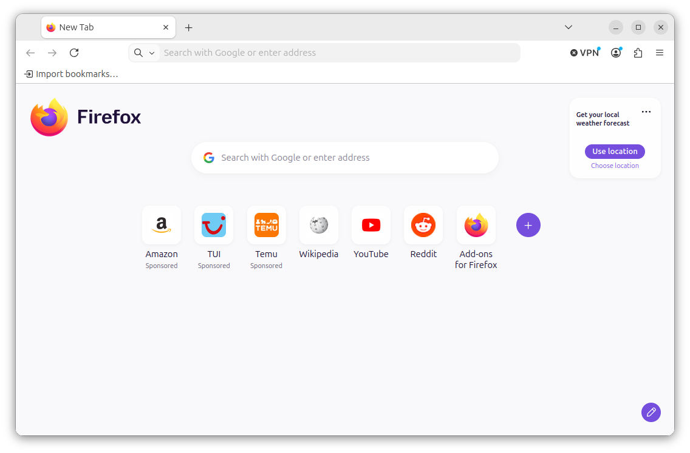
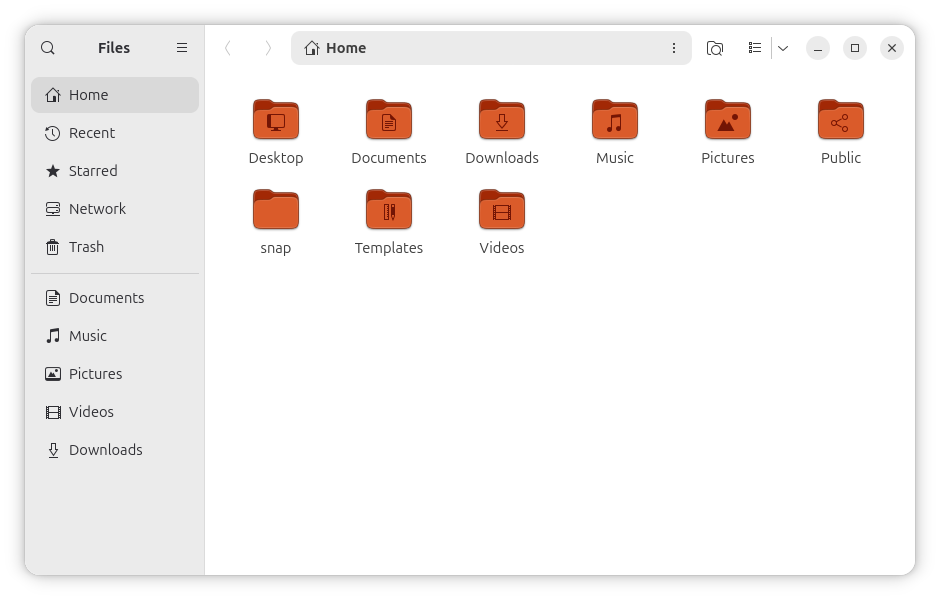
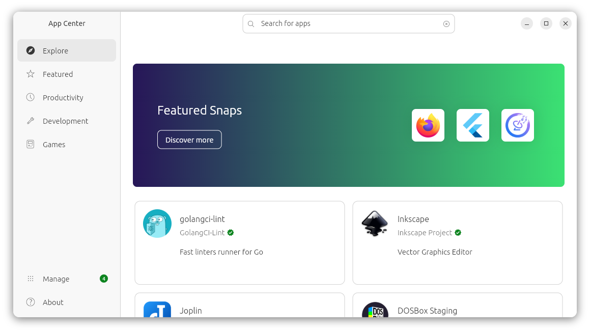
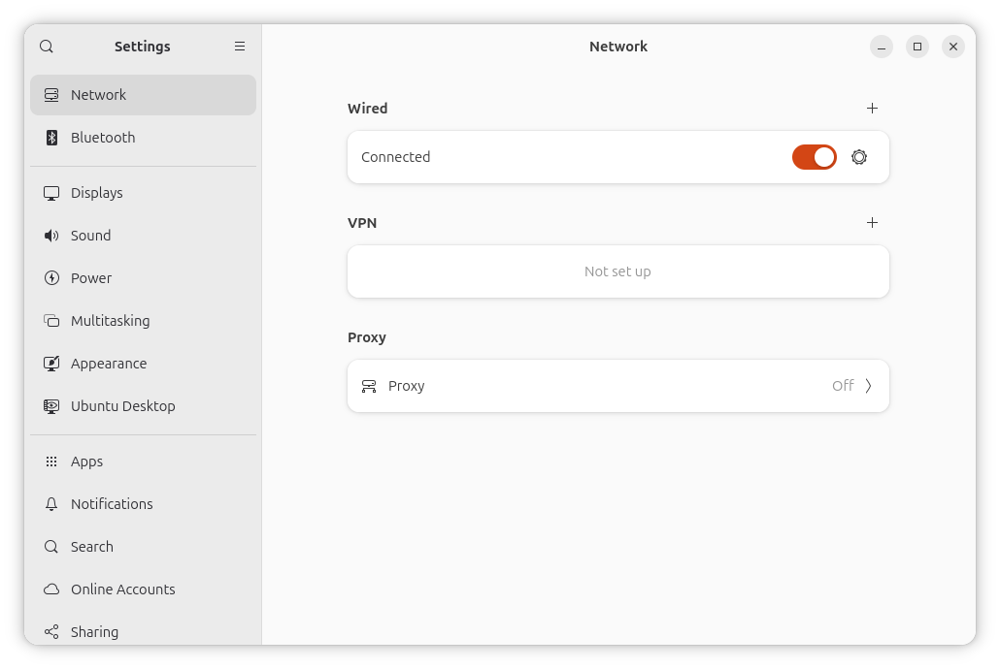

# Exercises 1

::: warning
These exercises are still in draft. The text isn't polished yet and new exercises may be added in the future.
:::

In these exercises, you'll continue exploring Ubuntu. You'll try out a few apps, install new software, and customize the desktop to your preferences.

## Exercise 1.1 {#firefox}

Open the Firefox web browser:



Navigate to the page you're on now, [download the lab materials for this course](TODO), and save this file to your **Downloads** directory. Continue browsing the web, download a few more files, and bookmark some of your favorite sites.

Next, open Firefox settings. Configure your home screen and set your search engine to something other than Google, such as [DuckDuckGo](https://duckduckgo.com) or [Ecosia](https://www.ecosia.org).

Finally, if you're interested in using Firefox on your host system as well, you can create an account to synchronize your bookmarks and settings between devices.

## Exercise 1.2

Open the Files app:



Familiarize yourself with this app as you explore your home directory. Verify that your **Downloads** directory contains the files you downloaded in the previous exercise.

## Exercise 1.3

Open App Center:



Explore its offerings and download an application that you know or would like to try. Pin this application to your dock.

## Exercise 1.4

Open the Settings app:



Perform the following tasks:

- Adjust your display resolution and scale to something that works well for your virtual machine.
- Try out the dark appearance. Switch back to the default appearance if you prefer that.
- Pick an accent color.
- Set a background image for your desktop.
- Adjust the size and position of the dock to your liking.
- Turn off Automatic Screen Lock. You don't need this in a virtual machine.

## Exercise 1.4

Use the Settings app to add an additional user account. Use the Quick Settings panel to switch to this account, then back to yours. Remove the account when you're done.

## Exercise 1.5

Open a terminal and run the following commands:

```bash
whoami
hostname
pwd
```

What do these commands have in common?

<details>
<summary>Solution</summary>
They all show part of the information that makes up the default prompt: your username, the hostname of your machine, and the current directory.
</details>
