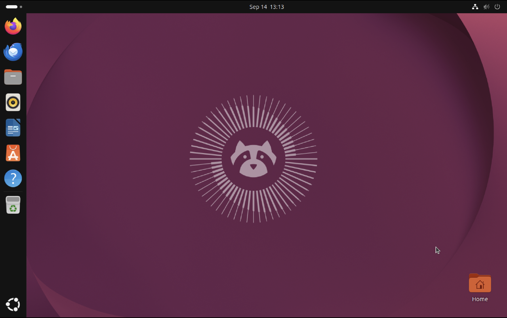
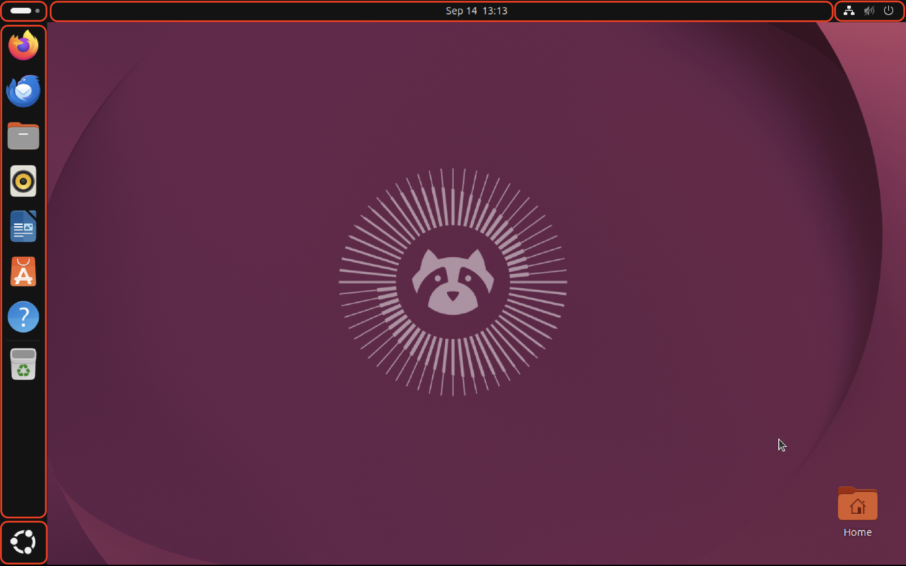
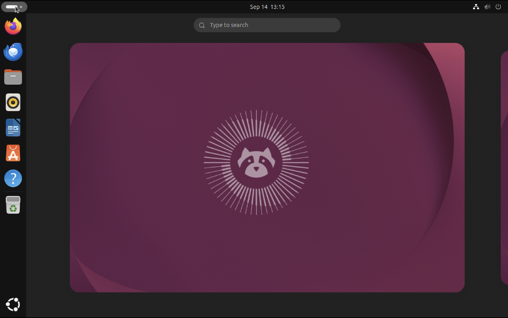
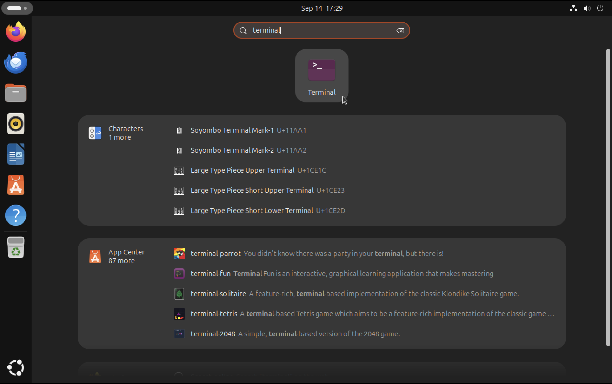
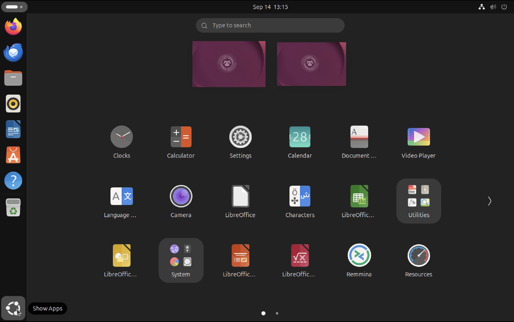
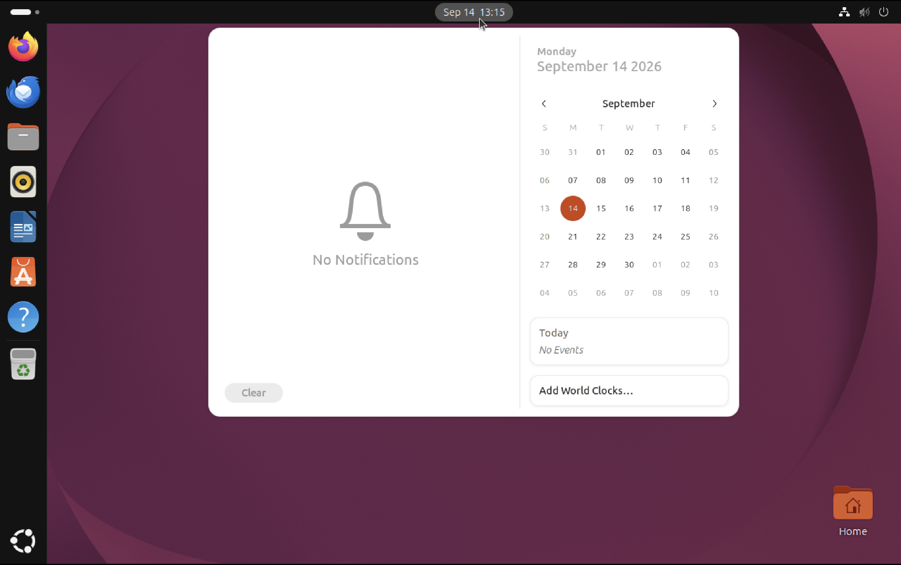
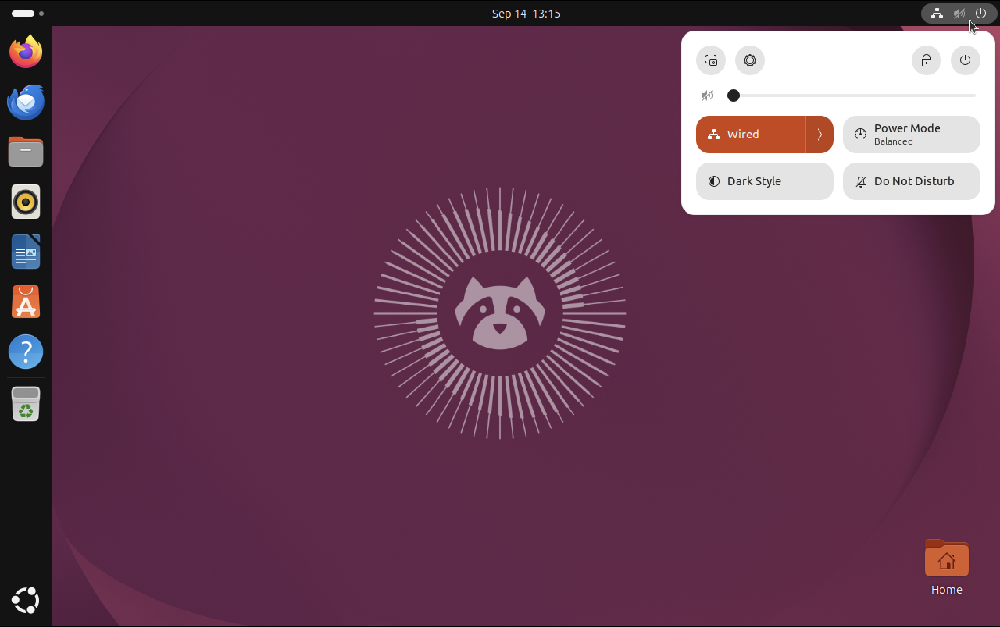
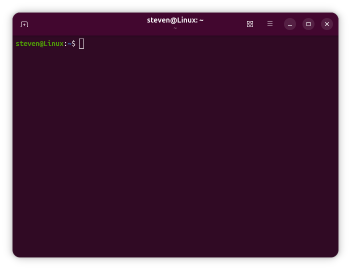

# Exploring Ubuntu

::: warning
This lab is still in draft. It contains all the information you need, but the text isn't polished yet.
:::

Ubuntu is a popular and easy to use distribution for new Linux users. It provides a familiar and welcoming desktop environment for users switching from Windows or macOS.

In this lab, you'll explore Ubuntu. You'll start with the desktop environment, then  move on to the command line.

## The desktop environment

Ubuntu's desktop environment is based on [GNOME](https://www.gnome.org), one of two major desktop environments for Linux (the other being [KDE](https://kde.org)).

The default desktop layout looks like this:



This layout places important panels and controls along the top and left sides of the screen. The screenshot below outlines these in red:



The most important control is in the top left. This button opens the **Activities Overview**, the central hub of the desktop:



From here, you can type to search for applications and launch them:



The Activities Overview also shows an overview of your workspaces — virtual desktops that group windows. You can navigate between workspaces, drag windows around, and so on. The “Activies Overview” button doubles as an indicator for the active workspace.

::: info
Although the “Activities Overview” button is always present, you'll usually open the Activities Overview by pressing the `Super` key, which is the key with the Windows logo, or the `Command` key on Apple hardware, provided that your hypervisor didn't reassign this key.
:::

On the left side of the screen is the **Dock**, which is where you can see your open applications and pin the ones you use most often.

At the end of the dock is a button that opens the **Applications Overview**. This screen displays a grid of your installed applications. It also offers some of the features of the Activities Overview:



Finally, the top of the screen is taken up by the **Top Bar**, which displays various controls and indicators. Click the current date and time to see your calendar and notifications:



The Top Bar also displays the **System Status Area**. Click this area to open the **Quick Settings** panel:



This panel includes a button to power off the virtual machine. Use this button to perform a proper shutdown. This is much safer than closing the hypervisor's window, which could leave the machine in an invalid state.

## Using the command line

An average Linux user will spend most of their time in the desktop environment, browsing the web, using office productivity apps, or playing games. However, the real power of Linux comes from the **command line**. This textual interface is where you type commands to manage the system, install and update software, automate workflows, and connect to remote servers. 

Textual interfaces are how computers used to work before they had graphical interfaces, and they're still the most powerful tool available to a system administrator.

On Ubuntu, you access the command line through the **Terminal** application:



The terminal gives you access to a **shell**, which is the program that processes your commands. The default shell on Ubuntu is **Bash**. When you open a terminal, Bash will show a **prompt**:

```bash
steven@Linux:~$ 
```

This prompt contains the following information:

- My username, “steven”.
- The hostname of my virtual machine, “Linux”. 
- The current directory, “~”, which refers to my home directory.

The prompt provides important contextual information. You can use the command line to navigate your system, sign in as a different user, and connect to other systems, so it's important to keep track of who and where you are.

The prompt uses an at sign (`@`) and colon (`:`) as separators and ends in a dollar sign (`$`). Type your command after this prompt, then press `Enter` to send it.

Try sending the following command:

```bash
ls
```

This command lists the contents of the current directory, in this case, your home directory.

Commands can take **arguments** to specify the files or directories they operate on. For example:

```bash
ls Downloads
```

This command lists the contents of the **Downloads** directory.

Commands can take multiple arguments:

```bash
ls Desktop Downloads
```

This command lists the contents of both the **Desktop** and the **Downloads** directory.

Commands also have **options** that configure their behavior. You specify an option as a dash sign (`-`) followed by a letter:

```bash
ls -l
```

Here, option `-l` causes `ls` to use a longer, more detailed, output format.

Keep in mind that options are case-sensitive. The following command will not work:

```bash
ls -L
```

Option `-L` may have a different meaning than `-l`, or in this case, no meaning at all.

You can specify multiple options, either separately, or grouped behind a single dash:

```bash
ls -l -h
ls -lh
```

These commands are equivalent and add the option `-h` to print file sizes in a human-readable format. Most options can be grouped in this way, and the order in which you specify them usually doesn't matter.

However, some options have longer names and cannot be grouped. You specify these options with a double dash:

```bash
ls -l --human-readable
```

In this case, `--human-readable` is equivalent to `-h`. The former is easier to understand, but the latter is easier to type.

Of course, options and arguments can be used together. A full command could look like this:

```bash
ls -lh Downloads
```

This command lists the contents of the **Downloads** directory using a long output format with human-readable sizes.

## Up next

This lab gave you a short tour of the Ubuntu operating system. The desktop environment should feel familiar to you, but the command line may take some getting used to.

All remaining labs will focus exclusively on using the command line. By the end of this course, you should feel at home in the terminal, and you'll come to understand and appreciate the power of the command line.

Complete the upcoming exercises, then continue on to the next lab, where you'll learn to manage files and directories from the command line.
