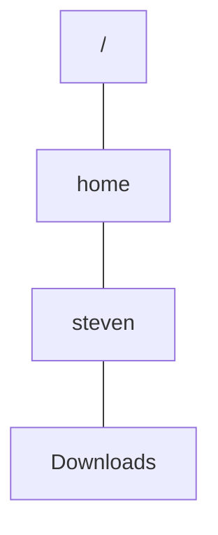
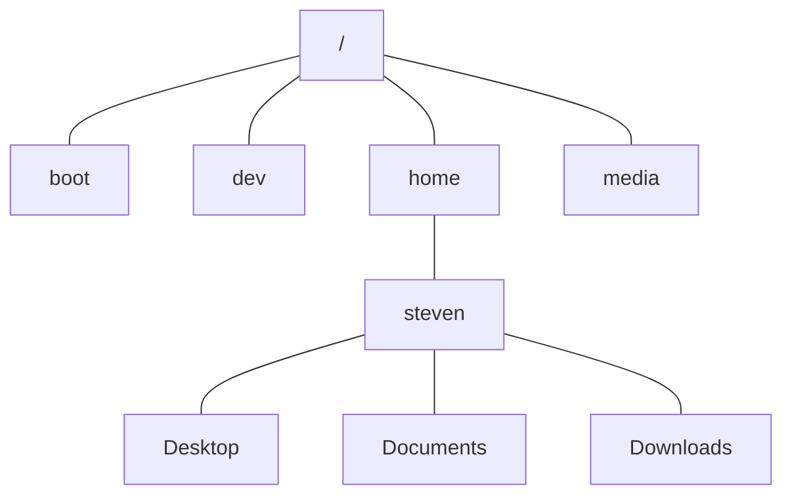
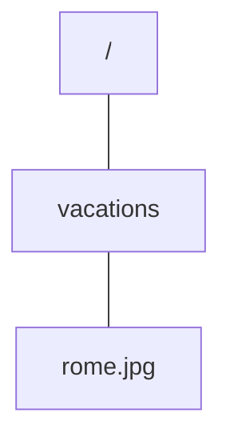
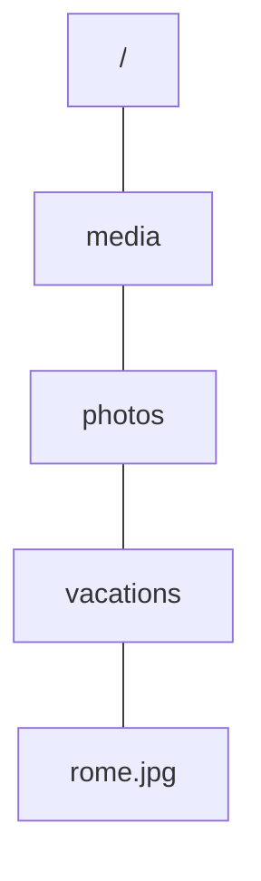
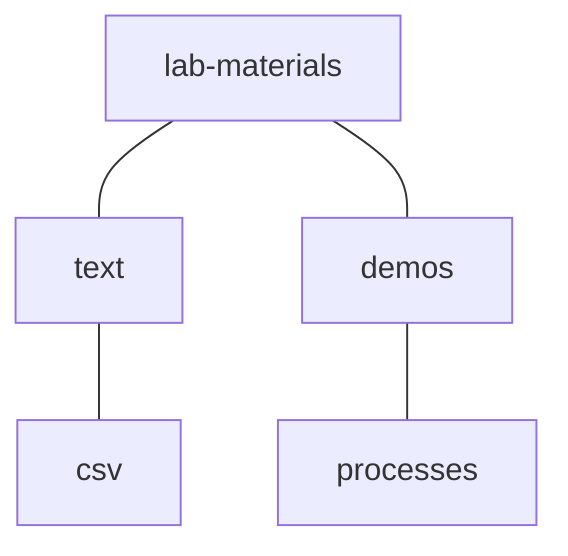

<script setup>
import { onMounted } from "vue";

onMounted(() => {
    // Avoid wrapping command options.
    document.querySelectorAll("code").forEach(el => {
        if (el.textContent.trim().length < 3) {
            el.style.whiteSpace = "nowrap";
        }
    });
})
</script>

# Files and Directories

In this lab, you’ll explore the file system and learn to manage files and directories.

You’ll start in your home directory, then explore the rest of the system. Once you’re familiar with the file system, you’ll learn to copy, move, and remove files. You’ll practice these skills by preparing the materials for the upcoming labs. Finally, you’ll learn a powerful way to search for files from the command line.

## Your home directory

Open a terminal and run the **`cd`** (*change directory*) command to navigate to your home directory:

```bash
cd
```

::: info
Most terminals start in your home directory by default.
:::

Next, run the **`pwd`** (*print working directory*) command to verify where you are:

```bash
pwd
```

This prints the path to your home directory, in my case **/home/steven**.

Next, use the **`ls`** (*list*) command to list the contents of your home directory:

```bash
ls
```

You should see familiar directories such as **Desktop**, **Documents**, and **Downloads**.

By default, `ls` doesn’t show hidden files and directories. Add the `-a` option to include these in the output:

```bash
ls -a
```

Note how all hidden files and directories have a name that starts with a dot. This simple naming convention is how you create hidden files on Linux.

To see the contents of a different directory, such as **Downloads**, specify it as an argument to `ls`:

```bash
ls Downloads
```

You can even specify multiple arguments to list the contents of several directories:

```bash
ls Documents Downloads
```

Most commands use arguments to specify which files or directories they operate on. However, if you find yourself repeatedly specifying the same directory as an argument, it may be easier to navigate into that directory first.

Use `cd` to navigate into the **Downloads** directory:

```bash
cd Downloads
```

This changes your working directory from your home directory to **Downloads**. Verify this using `pwd`:

```bash
pwd
```

It’s essential to keep track of your working directory as it affects the commands you run. For example, `ls` will now list the contents of your **Downloads** directory, because that is the current working directory:

```bash
ls
```

The output of this command should show the files you downloaded in [Exercise ??](). To find out more about these files, such as their sizes, use the `-l` option:

```bash
ls -l
```

Unfortunately, this prints the sizes in bytes. Add the `-h` option to print them in a human-readable format instead:

```bash
ls -lh
```

`ls` has many more options for you to discover; you’ll learn some of them later in this course.

In the next section, you’ll venture outside your home directory to explore the rest of the file system. Before you do that, practice using `cd` and `ls` to explore your home directory. When you’re done, return to the **Downloads** directory.

## Exploring the system

Use `pwd` to verify that you’re in the **Downloads** directory:

```bash
pwd
```

Next, repeat the following commands three times:

```bash
cd ..
pwd
```

Here, `..` is a reference to the *parent directory*: the directory that contains the working directory. You use this reference to navigate up in the directory hierarchy.

Compare the output of the four `pwd` commands. In my case, this output was:

```
/home/steven/Downloads
/home/steven
/home
/
```

This shows that the **Downloads** directory is a *subdirectory* of your home directory, which carries your username. Your home directory is in a directory named **home**, which is the parent directory for all home directories. Finally, **home** is a subdirectory of the **root directory** **/** (*slash*) — the start of the file system.

The full path to my **Downloads** directory is **/home/steven/Downloads**. This path starts from the root directory — the initial forward slash — then specifies the directories along the path, separated by forward slashes.

Visually, this path is as follows:



This hierarchical structure is known as a **tree**. The tree starts from a single directory: the root of the tree. Each directory in the tree may contain any number of files and subdirectories.

Here’s what the file system looks like with a few more directories added to the tree:



::: info
As you can see, computer scientists draw trees in an inverted way: the root of the tree is at the top and the tree branches downwards.
:::

### Root-level directories

Assuming you’re still in the root directory, inspect its contents with `ls`:

```bash
ls
```
Most of the directories you see here are part of the **Filesystem Hierarchy Standard (FHS)**. The following table describes some of these directories:

| Directory | Contents |
| --------- | -------- |
| **/bin** | Executable commands (*binaries*). |
| **/boot** | Files required for booting the system, such as the kernel. |
| **/dev** | Files that represent hardware devices, such as disk drives. |
| **/etc** | Configuration files. |
| **/home** | Home directories for the users. |
| **/lib** | Software libraries. |
| **/media** | Removable media, such as USB drives, DVDs, or CDs.<br>Some systems use **/run/media** instead. |
| **/opt** | Optional and self-contained software packages. |
| **/root** | Home directory for the **root** user — the primary system administrator.<br>Not to be confused with the root directory. |
| **/tmp** | Temporary files. |
| **/var** | Files that are continually changing, such as logs and caches. |

### Secondary and tertiary hierarchies

Linux also provides secondary and tertiary hierarchies under **/usr** and **/usr/local** respectively. These hierarchies have their own “root-level” subdirectories, such as **/usr/bin** and **/usr/local/bin**.

The distinction between these hierarchies is as follows:

- **/bin** contains applications required at startup.
- **/usr/bin** contains applications provided by the distribution, or through shared network storage.
- **/usr/local/bin** contains applications not provided by the distribution, or only installed locally.

However, this distinction is mostly historical and has lost much of its relevance. Many distributions, including Ubuntu, merge the primary and secondary hierarchies, resulting in a much simpler system:

- **/usr/bin** contains applications provided by the distribution.
- **/usr/local/bin** contains applications not provided by the distribution.

In these systems, **/bin** simply refers to **/usr/bin**.

### Virtual file system

If you’re familiar with Microsoft Windows, you may have noticed that Linux doesn’t use drive letters. Instead, Linux uses a **virtual file system**.

On Windows, each physical file system gets assigned a drive letter. A Windows system with two hard drives and one USB drive would use three letters: **C**, **D**, and **E**, with each letter having its own root directory. On Linux, these physical file systems would appear as a single tree — the virtual file system — with a single root directory.

To achieve this, Linux assigns each physical file system a **mount point**: a directory in the virtual file system that corresponds with the root of the physical file system.

As an example, suppose you have a drive which contains a file named **rome.jpg** in the **vacations** directory. In the *physical* file system, the path to this file would be **/vacations/rome.jpg**:



If you mount this drive at **/media/photos**, the photo will become available in the *virtual* file system at **/media/photos/vacations/rome.jpg**:



As the administrator of a Linux system, you can freely choose these mount points. You could, for example, use one hard drive for the root directory, and another one for **/home**.

Some file systems have fixed mount points. For example, removable media appear under **/media** or **/run/media**, and other temporarily mounted file systems appear under **/mnt**.

The virtual file system can even contain other virtual file systems. For example, the root-level directories **/proc** and **/sys** contain virtual file systems through which you can inspect the state of the system. Their contents are read from memory, not from a physical file system.

## Absolute and relative paths

Now that you understand the structure of the file system, you need to learn how to navigate it. So far, you’ve seen two ways to change your working directory:

- Navigate into a subdirectory using commands such as `cd Downloads`
- Navigate to a parent directory using `cd ..`

Both examples use **relative paths**. A relative path specifies the path to a target file or directory starting from the working directory.

You construct a relative path from path segments, separated by a forward slash. These path segments can be any of the following:

- The name of a file or directory.
- The special reference `..`, which refers to the parent directory.
- The special reference `.`, which refers to the current directory.

Here are some examples of relative paths:

```
.
lab-materials.zip
./lab-materials.zip
..
../Documents/README.md
../../../bin/ls
```

These paths are meaningless without the context of a working directory. Here’s what the paths refer to when you’re in the **Downloads** directory:

| Path | Target |
| ---- | ------ |
| **.** | The **Downloads** directory. |
| **lab-materials.zip** and<br>**./lab-materials.zip** | A file named **lab-materials.zip** in the **Downloads** directory. |
| **..** | Your home directory. |
| **../Documents/README.md** | A file named **README.md** in the **Documents** directory. |
| **../../../bin/ls** | The command `ls` in the root-level **bin** directory. |

Alternatively, you can specify paths as **absolute paths**. An absolute path does not depend on the working directory and fully specifies a path starting from the root directory. Therefore, an absolute path always starts with a forward slash.

Here are the previous examples again, specified as absolute paths:

```
/home/steven/Downloads
/home/steven/Downloads/lab-materials.zip
/home/steven
/home/steven/Documents/README.md
/bin/ls
```

In an absolute path, the tilde (**`~`**) character refers to your home directory. This means you can simplify the previous examples as follows:

```
~/Downloads
~/Downloads/lab-materials.zip
~
~/Documents/README.md
/bin/ls
```

Even though these paths don’t appear to start with a slash, they do: the tilde expands to the absolute path to your home directory.

Finally, you can use the dash (**`-`**) character to navigate to the previous working directory:

```bash
cd -
```

Your current working directory then becomes the previous working directory, so you can repeat this command to switch back and forth between two directories.

## Preparing the lab materials

[TODO: These instructions use fictitious files. They should be updated once the labs are finalized.]

So far, you’ve learned to navigate the file system and list the contents of a directory. In this section, you’ll learn commands to copy, move, and remove files and directories. You’ll practice these commands by preparing the materials for the upcoming labs.

First, navigate to your **Downloads** directory and list its contents:

```bash
cd ~/Downloads
ls
```

You should see a file named **lab-materials.zip**, which you downloaded in [Exercise ??](). This file contains the lab materials and uses ZIP compression to reduce the size of the archive.

Inspect the contents of this archive with the **`unzip`** command. Add the `-l` option to list the contents of the archive without unpacking it:

```bash
unzip -l lab-materials.zip
```

As you can see, the archive contains a lot of files, but no directories. Unpacking it in the **Downloads** directory would result in a lot of clutter.

Use the **`mkdir`** (*make directory*) command to create an empty directory named **lab-materials**:

```bash
mkdir lab-materials
```

Next, use `unzip` to extract the contents of the archive. Add the `-d` option to specify a target directory for the decompressed files:

```bash
unzip lab-materials.zip -d lab-materials
```

Finally, navigate to this directory and list its contents:

```bash
cd lab-materials
ls
```

Now that you’ve extracted the lab materials, you’ll organize these files into directories. The end result should be the following directory structure:



Start by creating the **text** directory:

```bash
mkdir text
```

Next, use the **`cp`** (*copy*) command to copy a file into this directory:

```bash
cp sample1.txt text
```

`cp` requires at least two paths as arguments: one for the *source* and one for the *destination*. The next example shows some variations of this command:

```bash
cp sample1.txt text
cp sample1.txt text/long-text.txt
cp sample2.txt sample3.txt text
```

::: warning
Do not execute these commands, they aren’t part of the lab.
:::

Here’s what these commands do:

1. This is what you executed earlier. This command specifies a source file and a target directory, and copies the file into that directory.
2. This variation specifies a target *file* instead of a target directory and renames the copy.
3. This variation specifies multiple source files and copies all of them into the target directory.

By default, `cp` doesn’t show any output. Add the `-v` option for verbose output:

```bash
cp -v sample1.txt text
```

As you can see, `cp` doesn’t prompt you to overwrite existing files. The previous command overwrote the file **text/sample1.txt** that you created earlier.

Add the `-i` option for interactivity, which will prompt you before overwriting any files:

```bash
cp -vi sample1.txt text
```

Alternatively, add the `-n` option to not overwrite any files:

```bash
cp -vn sample1.txt text
```

So far, you’ve only copied one file, but several more files need to go into the **text** directory. You could copy them one-by-one, or specify them all as arguments to `cp`, but there is a better alternative.

The files that need to go into the **text** directory all have similar names: they all end in `.txt`. You can copy these files all at once with the following command:

```bash
cp -vi *.txt text
```

This command uses a **wildcard** character (**`*`**). This particular wildcard means “any number of characters”, so the pattern `*.txt` translates to “any name ending in .txt”. Your shell will replace this pattern with any matching filename from the current directory, as if you had specified these files explicitly.

::: info
Wildcards are part of a feature known as **globbing**. You’ll learn about this feature in [Using the Shell](using-the-shell).
:::

Your next task is to gather all the files ending in `.csv` and put them in a **csv** directory. Run the following commands:

```bash
mkdir csv
cp -vi *.csv csv
```

These files contain comma-separated values (CSV), a type of text file that mimics a spreadsheet. Therefore, it makes sense to add the **csv** directory as a subdirectory to **text**. 

Try to run the following command:

```bash
cp -vi csv text
```

As you can see, `cp` skips directories unless you explicitly ask to copy them.

Add the `-R` option to copy the directory *recursively*:

```bash
cp -viR csv text
```

This will copy the directory itself, as well as its contents, including any subdirectories.


Now that all text files have been copied to their proper locations, you can safely remove the originals from the **lab-materials** directory. Use the **`rm`** (*remove*) command with wildcards to remove these files:

```bash
rm *.txt *.csv
```

`rm` has similar options as `cp`. You can add `-v` for verbose output, and `-i` for interactivity.

Remove the **csv** directory as well, since it too is no longer needed. Like `cp`, `rm` requires the `-R` option to recursively remove directories:

```bash
rm -R csv
```

Alternatively, you could first delete the contents of the directory, then remove the directory with the **`rmdir`** (*remove directory*) command:

```bash
rm csv/*
rmdir csv
```

`rmdir` only removes empty directories, that’s why you had to remove its contents first.

For the remaining files, you’ll take a different approach. What you’ve done so far — copying a file before removing the original — was safe but tedious. From now on, you’ll *move* files into their proper directories without creating additional copies.

First, create the **demos** directory and its **processes** subdirectory:

```bash
mkdir -p demos/processes
```

The `-p` option creates all directories along the given path that don’t exist already. In this case, it first creates the **demos** directory, then its **processes** subdirectory.

Next, use the **`mv`** (*move*) command to move the correct files into the **processes** directory:

```bash
mv processes*.sh demos/processes
```

This command uses a wildcard to move all files that start with `processes` and end in `.sh`.

`mv` has similar options as `cp`. You can add `-v` for verbose output, `-i` for interactivity, and `-n` for not overwriting any existing files.

All files are now organized into their proper directories. To confirm this, run `ls` with the `-R` option:

```bash
ls -R
```

This lists the contents of **lab-materials** recursively, so you can see the entire directory hierarchy.

## Searching for files

To wrap up this lab, you’ll use the powerful **`find`** command to search for files and directories from the command line.

To use `find`, you specify a directory to search and one or more *expressions* to filter the results. The following example searches for a file named **students.csv** in the current directory (`.`), which should still be **lab-materials**:

```bash
find . -name students.csv
```

This search is recursive, so it will find the file at **text/csv/students.csv**.

The `-name` expression performs a case-sensitive search. For more flexibility, you can use `-iname` instead, which performs a case-insensitive search:

```bash
find . -iname Students.csv
```

This search still returns **students.csv**, even though the search pattern contained an uppercase “S”.

`find` also supports wildcards. The following example returns all files from the **demos** directory that have the text “processes” in their name:

```bash
find demos -iname *processes*
```

However, there is an issue with this command. As you already know, your shell replaces wildcards with any matches from the current directory. That’s not the correct behavior here. These wildcards should be used by `find` to filter the search results; Bash shouldn’t process them.

Add quotes around the search pattern to fix this issue:

```bash
find demos -iname '*processes*'
```

These quotes tell Bash to disregard any special characters in the pattern.

::: info
Understanding how quotes work is essential when using the command line. You’ll learn more about quotes in [Using the Shell](using-the-shell).
:::

You may have noticed that the output of the previous search also included the **processes** directory. To limit the output to only include files, add a `-type` expression:

```bash
find demos -type f -iname '*processes*'
```

You use `-type f` to search for files, and `-type d` to search for directories.

So far, you’ve only searched for files and directories based on their name and type, but `find` can inspect many more properties. The following example searches for downloads from the past 7 days that are larger than 1MB:

```bash
find ~/Downloads -mtime -7 -size +1M
```

As you gain experience using the command line, you’ll be able to take advantage of the advanced features of `find`, but those are outside the scope of this lab.

## Up next

In this lab, you explored the file system and learned some basic commands for managing files. The next lab will focus on a specific category of files: **text files**. You’ll learn to read and write these files, and you’ll understand why text files are so important on Linux.
