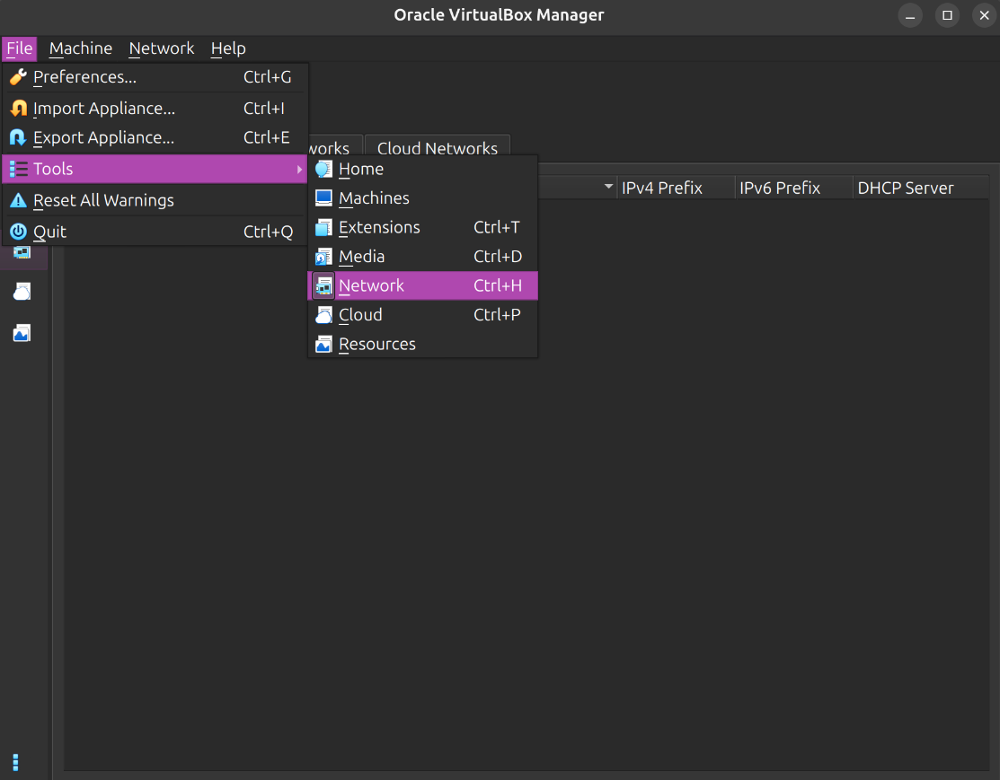
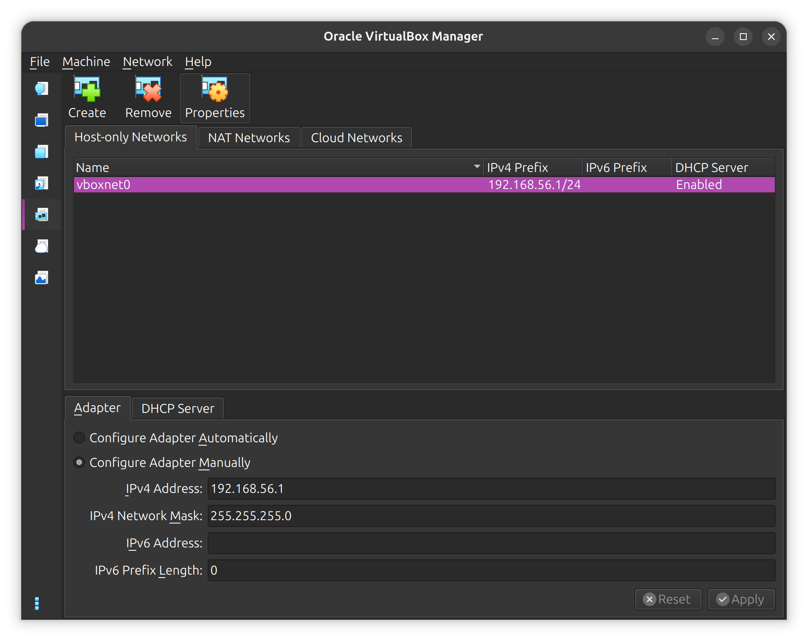
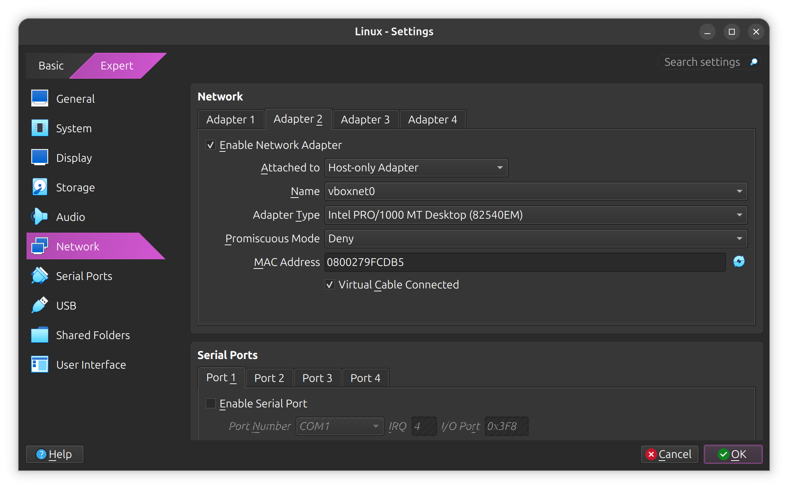
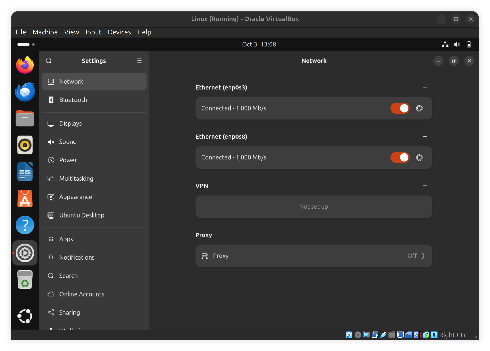
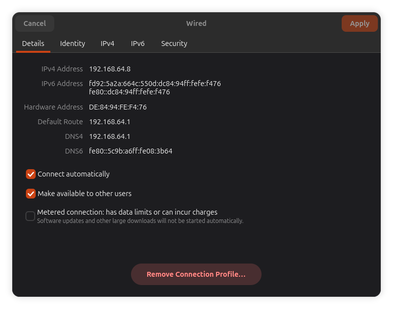
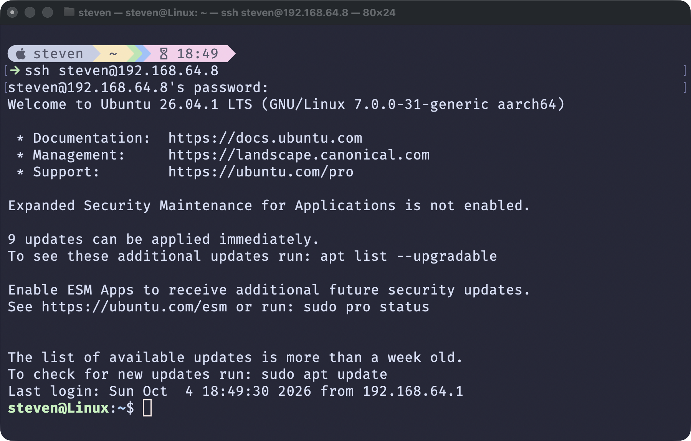

# Remote Login

::: warning
This lab is still in draft. It contains all the information you need, but the text isn't polished yet.
:::

In this lab, you'll learn how you can use **SSH** to connect to a Linux system remotely. You'll set up an SSH server on your virtual machine and connect to it from your host machine.

## About SSH

**SSH** (*secure shell*) is a network protocol used for secure remote login. You can use SSH to open a shell on a remote machine, send commands to it, and copy files over.

To use SSH, you need an SSH **server** on the machine you want to connect to, and an SSH **client** on the machine you want to connect from. In this lab, you'll install an SSH server on your Ubuntu virtual machine and connect to it from your Windows, macOS, or Linux host machine.

## Installing an SSH server

Use `apt` to install the **openssh-server** package:

```bash
sudo apt install openssh-server
```

This package registers an **ssh** system service. Start this service with the following command:

```bash
sudo systemctl start ssh
```

Also *enable* the service so that it starts automatically when you start the system:

```bash
sudo systemctl enable ssh
```

Finally, check the status of the service to confirm that it's active and enabled:

```bash
sudo systemctl status ssh
```

Your SSH server is now active and listening on port **22**, which is the default for SSH.

## Additional configuration for VirtualBox

To connect to your SSH server, you need a network connection between your host and virtual machine. In VirtualBox, you need to configure a **host-only network**. In UTM, this step is not required, so you can skip these instructions and continue with the next section.

Press `Ctrl+H` to open the VirtualBox Network Tools:



Create a host-only network:



By default, the network will be set to **192.168.56.1/24**. Confirm that its DHCP server is enabled.

Next, open the network settings for your virtual machine:



Enable the second network adapter and attach it to the host-only network you created earlier. Do not change the first network adapter because you need it to connect to the internet. The second adapter only creates a connection between your virtual machine and your host; it cannot connect to the internet.

Restart your virtual machine. You'll confirm the host-only network is working in the following sections.

## Finding your IP address

To connect to your SSH server, you need to know the **IP address** of your virtual machine.

Open the Settings app, go to Network, and click the gear icon next to your network connection:



In VirtualBox, you'll have two connections. Click the gear icon next to the second connection, labeled **enp0s8** in the screenshot above. This should be your host-only network.

In the connection details, find the field labeled **IPv4 Address**. In the screenshot below, my address is 192.168.64.8:



In the next section, you'll use this address to connect to your virtual machine.

::: warning
All subsequent examples will use my IP address `192.168.64.8` and my username `steven`. Replace these with the IP address of your virtual machine and your username.
:::

## Using an SSH client

Leave your virtual machine running and open a terminal on your *host* machine. On macOS or Linux, open the **Terminal** app. On Windows, open either **Terminal**, **PowerShell**, or **Command Prompt**. All of these should have the commands you need preinstalled.

In this terminal, use the **`ping`** command to test the network connection between your host and virtual machine. Specify the IP address of your virtual machine as an argument:

```bash
ping 192.168.64.8
```

This command sends small packets back and forth and reports how long they took to arrive. If the command keeps pinging indefinitely, press `Ctrl+C` to stop it.

::: warning
If `ping` shows network errors or timeouts, verify that you're using the correct IP address. On VirtualBox, verify that your host-only network is configured correctly, and that you're pinging the host-only adapter, not the original one, as they have different addresses.
:::

Now that you have a working connection, use the **`ssh`** command to connect to your virtual machine:

```bash
ssh steven@192.168.64.8
```

Here, you specify both the IP address of the machine you want to connect to and your username on that machine. You can also specify the port with the `-p` option:

```bash
ssh -p 22 steven@192.168.64.8
```

However, this is not required when you're using the default port of 22.

When you start an SSH session, the server will prompt you for the password for the username you provided. If that password is correct, the server prints a welcome message and opens a shell. Here's what that looks like for me, connecting from a macOS host:



Any commands you type here are executed on your virtual machine, even though you're using a terminal on your host machine. Try running the following command:

```bash
echo "Hello!" > ~/Desktop/hello.txt
```

This command creates a file on your desktop. Verify that this file was created, then return to your SSH session and try a few more commands. When you're done, use the `exit` command to close your session and return to your original shell.

Using SSH to connect to a virtual machine that's running on your own device may not be very interesting. However, that same `ssh` command can connect to *any* machine that has an SSH server. All you need is an IP address and your username and password.

In [Exercise 6.3](../exercises/exercises6#bandit), you'll use SSH to connect to a remote server over the internet.

## Copying files over SSH

SSH lets you copy files over the network through the **`scp`** (*Secure Copy Protocol*) command. To try this out, open a terminal on your host machine, but don't start an SSH session.

Run the following command to copy the file you created earlier from the desktop on your virtual machine to the current directory on your host machine:

```bash
scp 'steven@192.168.64.8:~/Desktop/hello.txt' .
```

This command specifies a remote path to **hello.txt** by prefixing an IP address and a username. The quotes around this path prevent the tilde from getting parsed on your host machine, since it refers to your home directory on the virtual machine.

`scp` is very useful for quickly copying files over the network. Behind the scenes, this command actually uses **SFTP** (*SSH File Transfer Protocol*) instead of the outdated Secure Copy Protocol it was originally named after. SFTP is more secure and more versatile than SCP. You'll try it out in [Exercise 6.2](../exercises/exercises6#sftp).

## Up next

This concludes the final lab for this course. Before you wrap up, work your way through the final exercises, where you'll practice using SSH and SFTP.
