# Setting Up a Virtual Machine

::: warning
This lab is still in draft. It contains all the information you need, but the text isn't polished yet.
:::

In this lab, you'll prepare the virtual machine you need for these labs. You'll install a **hypervisor** that can create a virtual machine, and you'll install **Ubuntu** as the operating system for that virtual machine.

## Prerequisites

To create your virtual machine, you need both a hypervisor and an Ubuntu installation disc suitable for your machine.

A **hypervisor** is software that creates and manages virtual machines. In this lab, you'll install a hypervisor that runs on top of your host operating system (Windows, macOS, or Linux). You'll install either [**VirtualBox**](https://www.virtualbox.org/wiki/Downloads) or [**UTM**](https://mac.getutm.app).

The table below shows which hypervisor is recommended for your host operating system and CPU:

Operating System | CPU | Hypervisor | Architecture
---------------- | --- | ---------- | ------------
Windows | AMD | VirtualBox | Intel / AMD 64-bit
Windows | Intel | VirtualBox | Intel / AMD 64-bit
Windows | Snapdragon | VirtualBox* | ARM 64-bit
macOS | Apple Silicon | UTM | ARM 64-bit
macOS | Intel | VirtualBox | Intel / AMD 64-bit
Linux | AMD | VirtualBox | Intel / AMD 64-bit
Linux | Intel | VirtualBox | Intel / AMD 64-bit
Linux | Snapdragon | VirtualBox* | ARM 64-bit

::: info
Configurations with an asterisk (`*`) are experimental, as VirtualBox only has limited support for the ARM architecture. VirtualBox also has experimental support for Apple Silicon (M1, M2, …) but UTM performs much better on these machines.
:::

The table also shows the **architecture** of your host machine. Ubuntu offers installation discs for both architectures. Pick the architecture that matches your host machine, or you won't be able to install Ubuntu on your virtual machine.

Download Ubuntu Desktop 26.04 LTS from [https://ubuntu.com/download/desktop](https://ubuntu.com/download/desktop). You'll download an **iso** file that contains an exact copy of a physical installation disc. You'll use this file to install Ubuntu on your virtual machine. Wait for the file to download, then continue with the instructions for your hypervisor.

## Creating a virtual machine in VirtualBox

Download VirtualBox from [https://www.virtualbox.org/wiki/Downloads](https://www.virtualbox.org/wiki/Downloads) and install it.

::: info
If you're already running Linux (which is awesome, by the way), it may be easier to install VirtualBox through your distribution's package manager. If you're taking that route, also install the VirtualBox Guest Additions, as you'll need those later.
:::

When you first launch VirtualBox, you'll see the following screen:

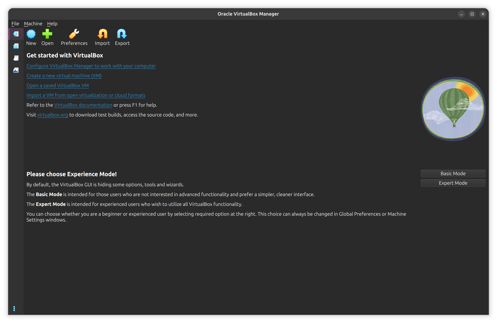

Select “Expert Mode”, then click “New” to create a virtual machine.

For the “ISO Image”, select the file you downloaded earlier. Uncheck “Proceed with Unattended Installation” and select “Linux” as the operating system, “Ubuntu” as the distribution, and “Ubuntu (64 bit)” as the version:

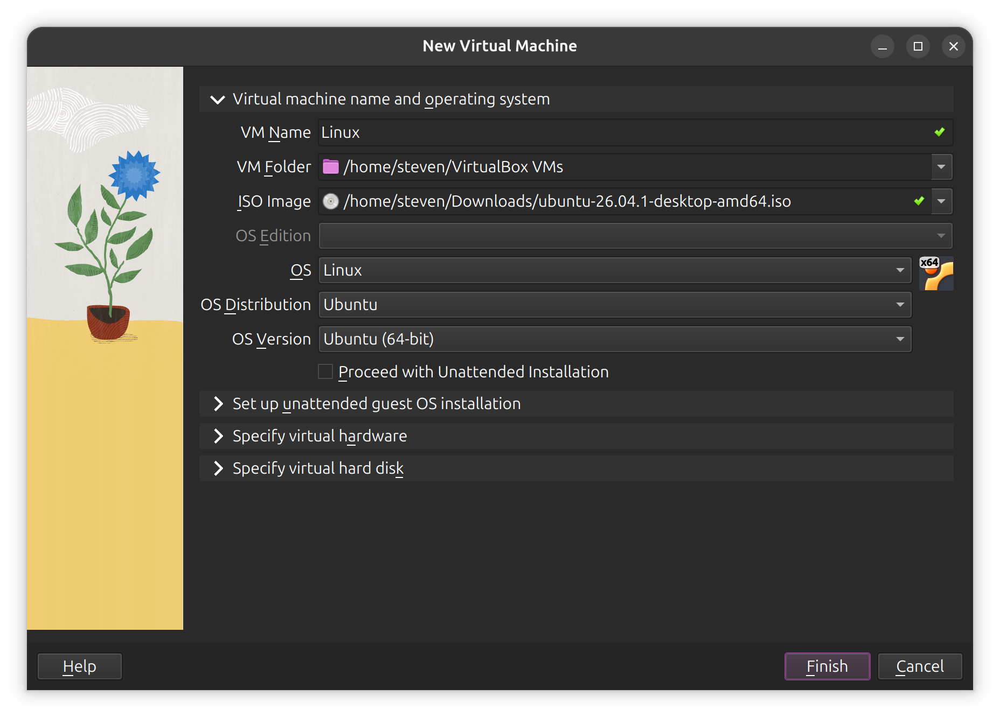

Under “Specify virtual hardware”, allocate at least 4096MB of RAM and two CPU cores:

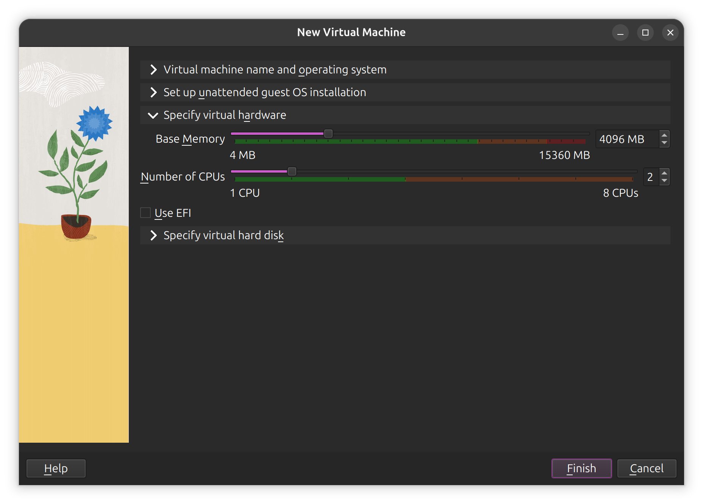

Under “Specify virtual hard disk”, select “Create a New Virtual Hard Disk” and allocate at least 64GB of storage:

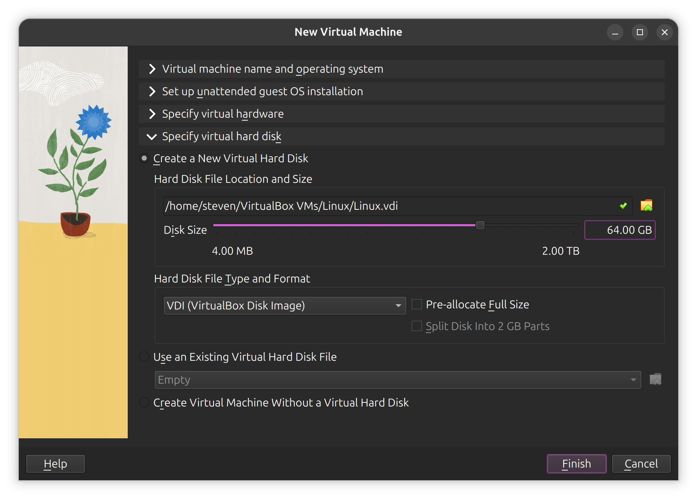

Create your virtual machine, but don't start it yet.

Click “Settings”, go to “Display” and maximize the “Video Memory”:

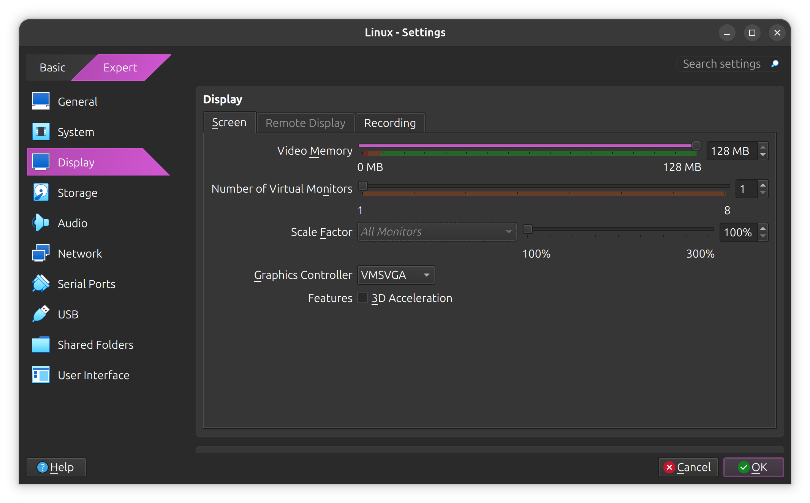

Go to “Storage” and verify that the installation disc is inserted and that you have a virtual hard disk:

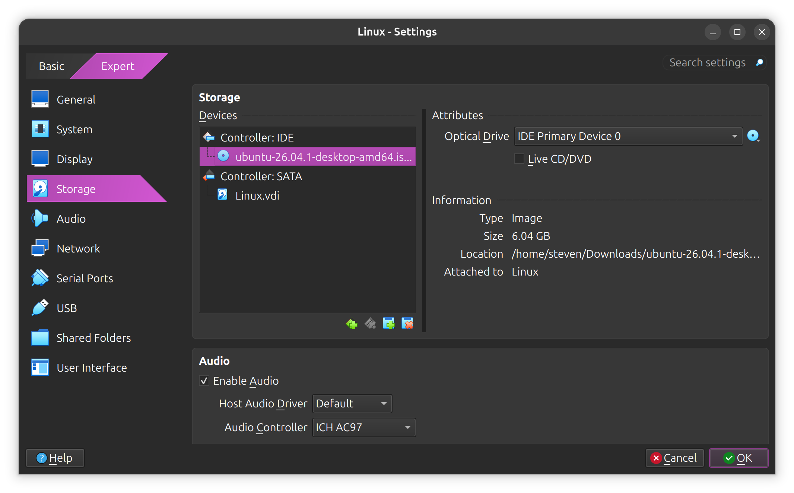

Save your settings, then start the virtual machine.

## Creating a virtual machine in UTM

Download UTM from [https://mac.getutm.app](https://mac.getutm.app) and install it into the **Applications** directory.

When you first launch UTM, you'll see the following screen:

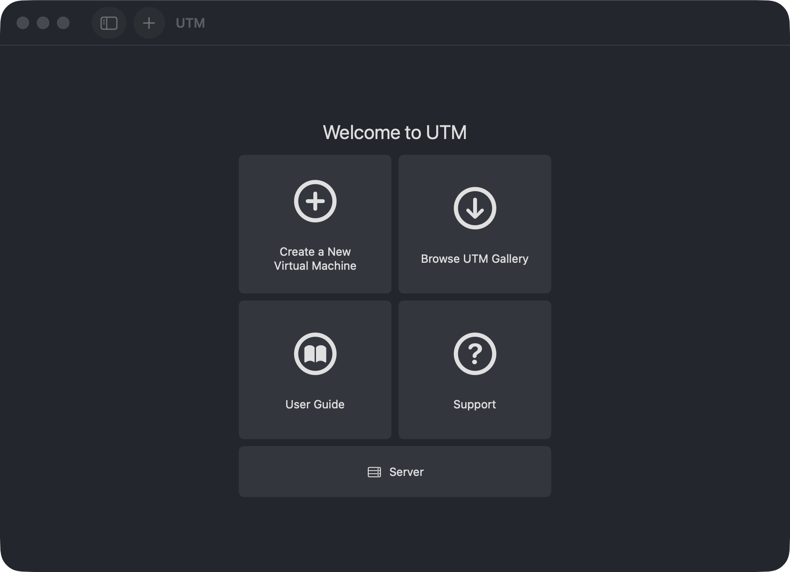

Select “Create a New Virtual Machine” and create a virtual machine with the following configuration:

- Select “Virtualize”, not “Emulate”.
- Select “Linux” as the guest operating system.
- Allocate at least 4096MB of RAM and two CPU cores.
- For the "Boot Image Type", select “Boot from ISO image”, then click “Browse” and select the file you downloaded earlier.
- Allocate at least 64GB of storage.
- A shared directory is optional; you don't need one for this course.

Save your configuration, then start the virtual machine.

## Installing Ubuntu

If your virtual machine was configured correctly, it should boot from the installation disc and show the following screen:

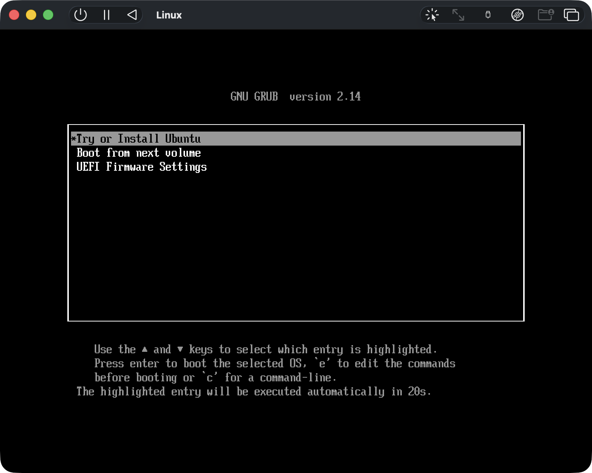

Select “Try or Install Ubuntu”.

The Ubuntu installation process is fairly straightforward. You'll be asked to select your language, choose a keyboard layout, set your time zone, create a user account, and so on.

Pay extra attention to the following steps:

- Select “Use wired connection” to connect to the internet. Your hypervisor will provide this connection to the virtual machine.
- Select “Install Ubuntu”, not “Try Ubuntu”.
- Select “Interactive installation”.
- When asked what apps you would like to install, either option is fine. The “Default selection” contains everything you need for this course, but the “Extended selection” gives you a richer experience.
- No proprietary software is required for this course, but you may want to install support for additional media formats.
- Select “Erase disk and install Ubuntu”. That sounds scary, but it only erases your virtual hard disk, not your actual one.

When the installation completes, you'll be asked to restart your virtual machine. As the machine reboots, you have to remove the installation disc or you'll end up back in the Ubuntu installer.

In VirtualBox, click the CD icon in the bottom tray:

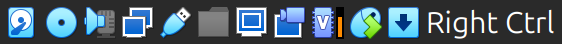

In UTM, click the CD icon in the toolbar:


From there, you can eject the installation disc.

You'll know the installation was succesful when Ubuntu prompts you to sign in with the account you created during installation:

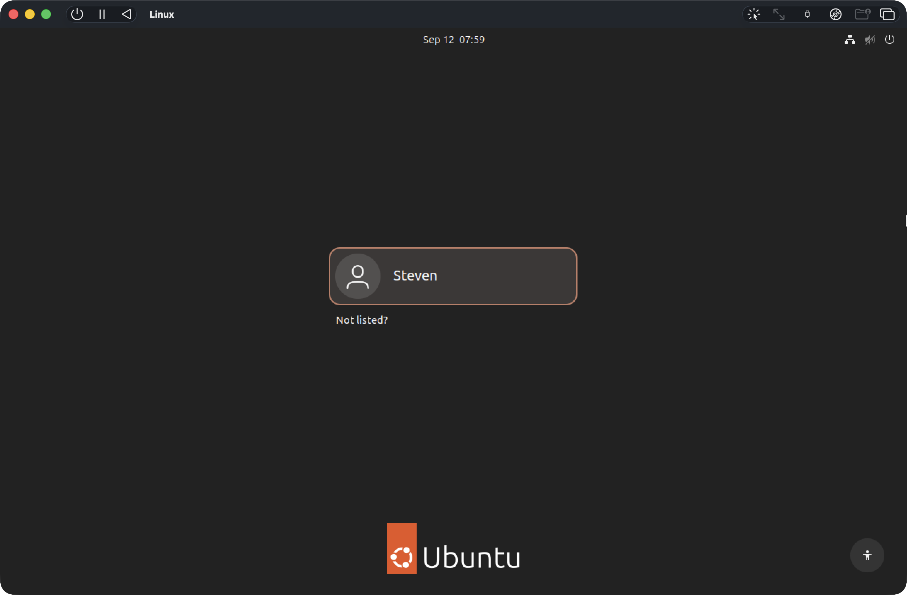

After signing in, click your way through the final setup screens, and you're ready to use Ubuntu!

## Additional configuration for VirtualBox

If you're using VirtualBox, I highly recommend that you install the Guest Additions in your virtual machine. These additions add support for drag and drop, shared folders, and a shared clipboard, and provide overall better performance.

First, install some required software from the command line. Press the `Windows` or `Command` key, type “terminal” to search for the Terminal application, and open it.

Run the following commands:

```bash
sudo apt update
sudo apt install build-essential dkms
```

Press `Enter` after each command and follow the on-screen instructions. When you're done, close Terminal.

::: info
You'll learn to use the command line in the next lab, and you'll learn more about installing software in [Package Management](package-management).
:::

Select “Devices” ▸ “Insert Guest Additions CD image...” from the menu bar. This will attach the Guest Additions CD as a virtual disc, which should show up in the sidebar of the Files application:

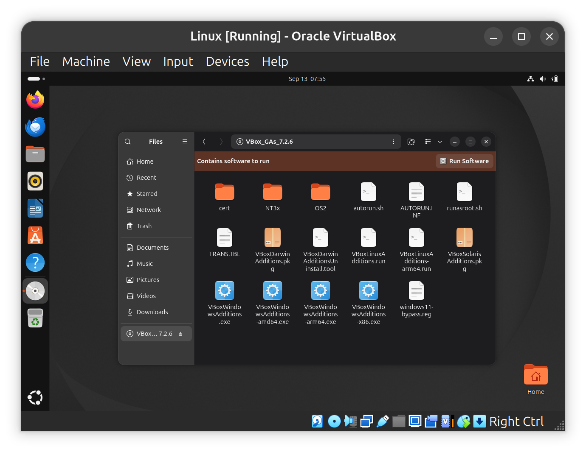

Click “Run Software” to install the Guest Additions and restart the virtual machine when you're done.

## Up next

In the next lab, you'll explore Ubuntu and learn to use both the graphical user interface and the command line.
